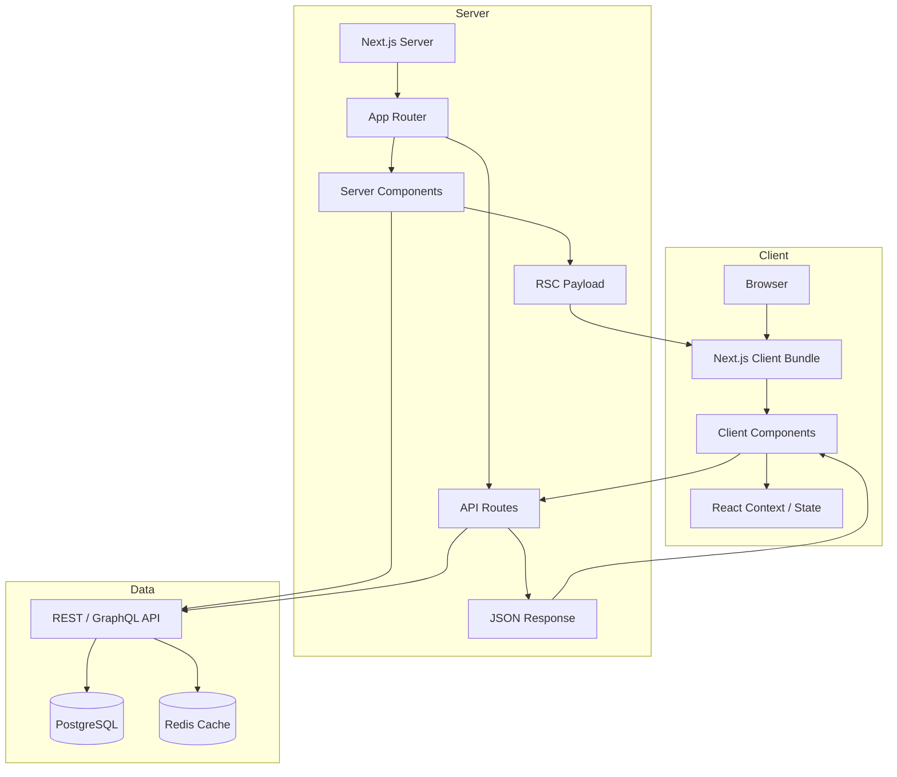
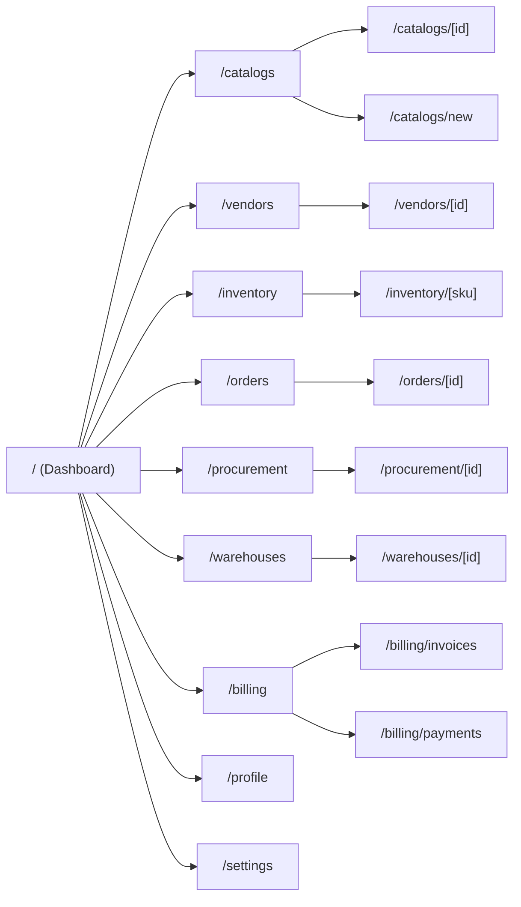
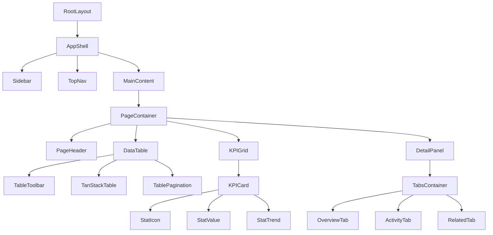
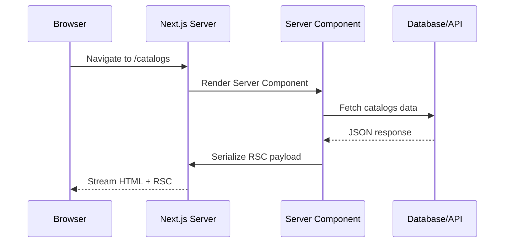
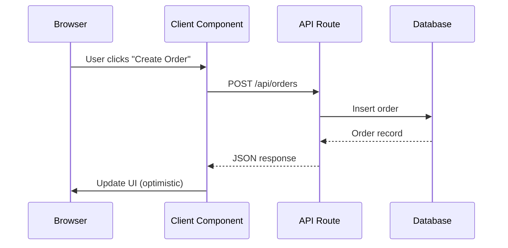

# MERIDIAN — Architecture

> Architecture overview for the MERIDIAN Procurement Ecosystem platform.

---

## Table of Contents

- [Architecture Overview](#architecture-overview)
- [Route Design](#route-design)
- [Component Hierarchy](#component-hierarchy)
- [Data Flow](#data-flow)
- [Module Design](#module-design)

---

## Architecture Overview

MERIDIAN follows a **layered architecture** built on Next.js 16 App Router. Server Components handle data fetching and static rendering, while Client Components are isolated to interactive UI elements.

### High-Level Diagram



### Rendering Strategy

| Strategy | Use Case | Modules |
|---|---|---|
| **Static (SSG)** | Public catalog pages, marketing | Catalog (read-only), docs |
| **Dynamic (SSR)** | Authenticated pages, dashboards | Dashboard, Orders, Procurement |
| **Client-side** | Real-time interactions, mutations | Inventory updates, forms |

---

## Route Design

The application exposes the following route groups under `src/app/`:



### Route Group Convention

```
src/app/
├── (dashboard)/         # Dashboard layout with shell
│   └── page.tsx
├── catalogs/            # Catalog management
│   ├── page.tsx
│   ├── [id]/page.tsx
│   └── new/page.tsx
├── vendors/             # Vendor relations
│   ├── page.tsx
│   └── [id]/page.tsx
├── inventory/           # Inventory tracking
│   ├── page.tsx
│   └── [sku]/page.tsx
├── orders/              # Order processing
│   ├── page.tsx
│   └── [id]/page.tsx
├── procurement/         # Procurement workflow
│   ├── page.tsx
│   └── [id]/page.tsx
├── warehouses/          # Warehouse logistics
│   ├── page.tsx
│   └── [id]/page.tsx
├── billing/             # Billing automation
│   ├── page.tsx
│   ├── invoices/page.tsx
│   └── payments/page.tsx
├── profile/             # User profile
│   └── page.tsx
└── settings/            # App settings
    └── page.tsx
```

---

## Component Hierarchy



### Component Layers

| Layer | Description | Server/Client |
|---|---|---|
| **Layout** | RootLayout, AppShell, Sidebar, TopNav | Mixed |
| **Pages** | Route entry points, data fetching | Server by default |
| **Composed** | Page-specific sections (KPIGrid, DataTable) | Client |
| **Primitives** | shadcn/ui (Button, Dialog, Table, etc.) | Client |

---

## Data Flow

### Server Component Data Flow



### Client Component Data Flow



---

## Module Design

### Dashboard Module

- **Purpose**: Central KPI monitoring and quick actions
- **Data sources**: Aggregated counts from all modules
- **Key components**: KPIGrid, RecentOrders, VendorChart, InventoryAlerts
- **Rendering**: SSR with client-side refresh interval

### Catalog Module

- **Purpose**: Product and SKU management
- **Data sources**: Products table, categories, suppliers
- **Key components**: CatalogTable, ProductForm, VariantEditor, PricingPanel
- **Rendering**: SSR for list, SSR for detail, client for mutations

### Inventory Module

- **Purpose**: Real-time stock tracking and alerts
- **Data sources**: Inventory ledger, warehouse allocations
- **Key components**: InventoryTable, StockAlertBadge, TransferForm
- **Rendering**: SSR with WebSocket updates (future)

### Order Module

- **Purpose**: Order lifecycle management
- **Data sources**: Orders, line items, shipments
- **Key components**: OrderTable, OrderDetail, FulfillmentPanel
- **Rendering**: SSR with optimistic client updates

---

## Error Boundaries

Each route segment wraps its page content in an error boundary:

```
app/
├── error.tsx           # Root error boundary
├── catalogs/
│   ├── error.tsx       # Catalog-specific error
│   └── loading.tsx     # Catalog skeleton
```

---

## State Management

| Concern | Solution | Scope |
|---|---|---|
| Server state | Server Components + RSC Payload | Page-level |
| Client state | React `useState` / `useReducer` | Component-level |
| UI state | React Context | Theme, sidebar |
| Form state | Zod + local state | Form-level |
| Cache | Next.js `fetch` cache + Redis | Data layer |

---

## Performance Considerations

- **Route Segment Config**: `export const dynamic = 'force-dynamic'` on interactive pages
- **Streaming**: Use `loading.tsx` for Suspense boundaries per route
- **Image Optimization**: Next.js `<Image>` with remote patterns configured
- **Bundle Splitting**: Dynamic imports for heavy components (data tables, charts)
