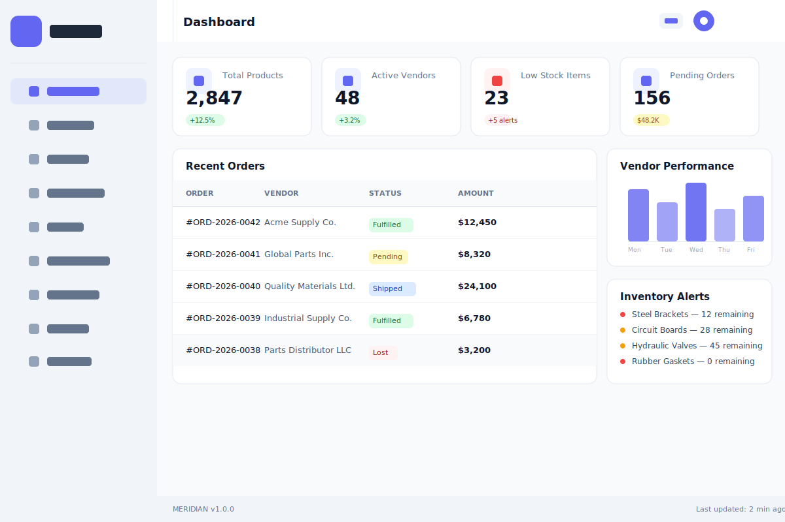
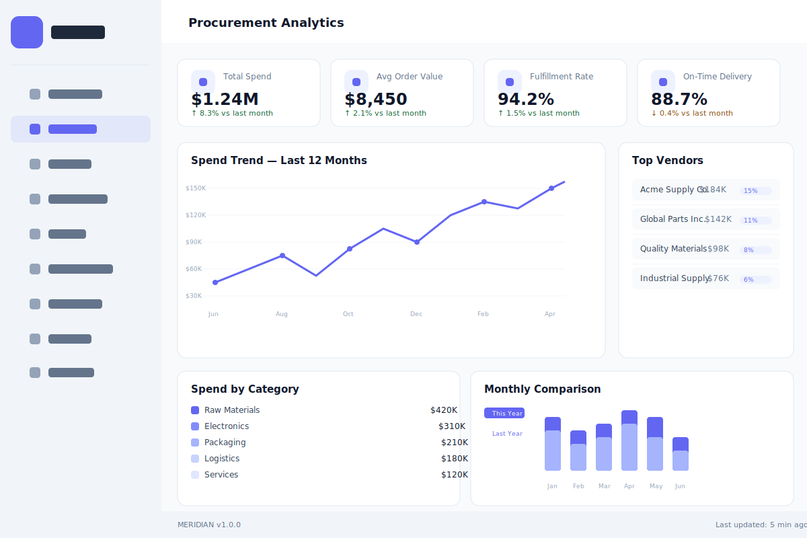
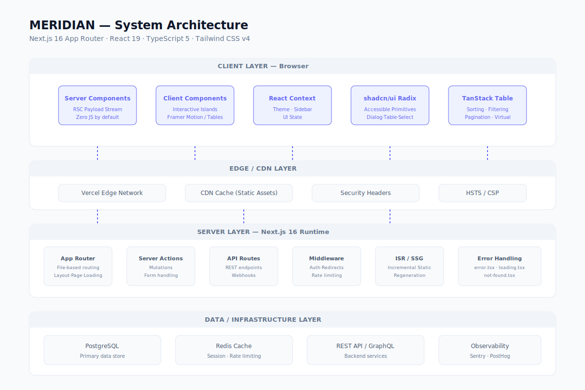
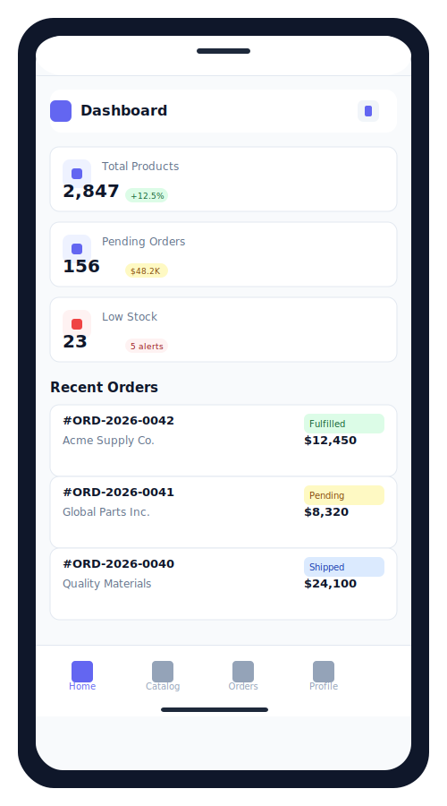
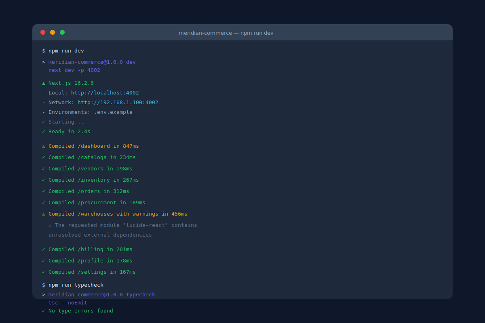
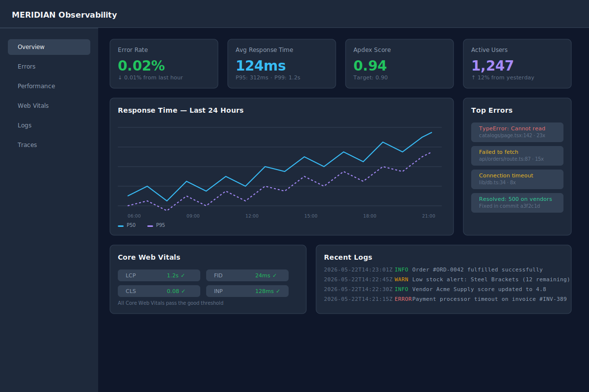
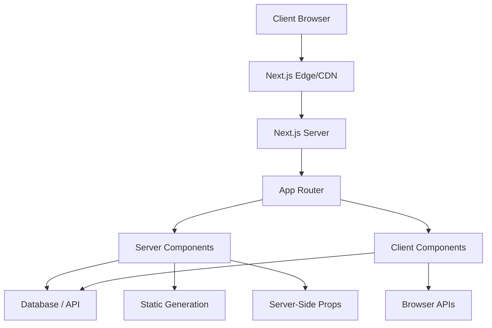

# MERIDIAN — Procurement Ecosystem

> **Enterprise procurement platform.** Catalog management, vendor relations, inventory tracking, order processing, procurement workflows, warehouse logistics, and billing automation — unified under a clean, performant interface.

[](https://nextjs.org/)
[](https://www.typescriptlang.org/)
[](https://tailwindcss.com/)
[](LICENSE)

---

## Table of Contents

- [Overview](#overview)
- [Features](#features)
- [Tech Stack](#tech-stack)
- [Screenshots](#screenshots)
- [Architecture](#architecture)
- [Getting Started](#getting-started)
- [Environment Setup](#environment-setup)
- [Deployment](#deployment)
- [Engineering Highlights](#engineering-highlights)
- [Project Structure](#project-structure)
- [Roadmap](#roadmap)
- [Scalability Notes](#scalability-notes)
- [Observability Notes](#observability-notes)
- [Contributing](#contributing)
- [Security](#security)
- [License](#license)
- [Contact](#contact)

---

## Overview

MERIDIAN is a full-featured enterprise procurement ecosystem inspired by Shopify Enterprise, SAP Ariba, and Medusa. It provides end-to-end procurement operations — from product catalog creation and vendor sourcing through order fulfillment, warehouse logistics, and billing reconciliation.

Built with Next.js 16 App Router, React 19, TypeScript 5 strict mode, and Tailwind CSS v4, MERIDIAN delivers a responsive, accessible, and highly performant operational interface for procurement teams of any scale.

---

## Features

| Module | Description |
|---|---|
| **Dashboard** | Real-time KPI monitoring, inventory health, order stats, vendor performance charts |
| **Catalog Management** | Product listings, SKU management, categories, variants, pricing tiers |
| **Vendor Relations** | Supplier profiles, contracts, performance scoring, communication log |
| **Inventory Tracking** | Real-time stock levels, low-stock alerts, batch tracking, warehouse allocation |
| **Order Processing** | Order creation, fulfillment tracking, shipping management, returns |
| **Procurement Workflow** | Purchase requests, approvals, POs, receiving, three-way matching |
| **Warehouse Logistics** | Multi-location inventory, bin locations, transfers, receiving schedules |
| **Billing Automation** | Invoicing, payment reconciliation, credit memos, aging reports |

---

## Tech Stack

| Layer | Technology |
|---|---|
| **Framework** | Next.js 16.2.6 (App Router) |
| **UI Library** | React 19.2.4 |
| **Language** | TypeScript 5 (strict mode) |
| **Styling** | Tailwind CSS v4, `tailwindcss-animate` |
| **Components** | shadcn/ui (Radix UI primitives) |
| **Animation** | Framer Motion |
| **Tables** | @tanstack/react-table v8 |
| **Icons** | Lucide React |
| **Validation** | Zod |
| **Utility** | clsx, tailwind-merge, class-variance-authority |
| **Dev Tools** | ESLint, Prettier |

---

## Screenshots

| Dashboard | Analytics | Architecture |
|---|---|---|
|  |  |  |

| Mobile | Terminal | Observability |
|---|---|---|
|  |  |  |

---

## Architecture

The application follows the Next.js 15+ App Router convention with server components by default and client component isolation. Data fetching leverages React Server Components for initial page load and SWR/fetch for client-side mutations.



See [ARCHITECTURE.md](ARCHITECTURE.md) for the full breakdown.

---

## Getting Started

### Prerequisites

- Node.js 20+
- npm 10+

### Installation

```bash
git clone <repo-url>
cd meridian-commerce
npm install --legacy-peer-deps
```

### Development

```bash
npm run dev
```

Open [http://localhost:4002](http://localhost:4002).

### Build

```bash
npm run build
npm run start
```

### Type Checking

```bash
npm run typecheck
```

---

## Environment Setup

Copy the example env file and fill in your values:

```bash
cp .env.example .env.local
```

| Variable | Description | Required |
|---|---|---|
| `NEXT_PUBLIC_APP_URL` | Public-facing app URL | Yes |
| `NEXT_PUBLIC_API_URL` | Backend API base URL | Yes |
| `AUTH_SECRET` | Encryption secret for auth tokens | Production |
| `DATABASE_URL` | PostgreSQL connection string | Production |
| `REDIS_URL` | Redis connection string | Optional |
| `NEXT_PUBLIC_POSTHOG_KEY` | PostHog analytics key | Optional |
| `NEXT_PUBLIC_SENTRY_DSN` | Sentry error tracking DSN | Optional |

---

## Deployment

### Vercel (Recommended)

```bash
npm i -g vercel
vercel --prod
```

The `vercel.json` at the project root configures security headers and routing. Deploy from the `main` branch for production.

### Manual

```bash
npm run build
npm run start
```

### Docker

```bash
docker build -t meridian-commerce .
docker run -p 4002:4002 meridian-commerce
```

See [docs/deployment/docker.md](docs/deployment/docker.md) for production Docker configurations.

---

## Engineering Highlights

- **Server Components by default** — minimal client-side JavaScript; only interactive islands use `"use client"`
- **TypeScript strict mode** — full type safety across props, API responses, and state
- **shadcn/ui primitives** — accessible, composable, unstyled Radix UI components with Tailwind styling
- **Framer Motion page transitions** — smooth route animations without layout shift
- **Responsive design** — mobile-first layouts with breakpoint-aware data tables
- **TanStack Table** — virtualized rows, column sorting, filtering, pagination, and row selection
- **Zod validation** — runtime type safety for forms and API communication

---

## Project Structure

```
meridian-commerce/
├── public/
│   ├── screenshots/
│   └── ...
├── src/
│   ├── app/
│   │   ├── (dashboard)/
│   │   ├── catalogs/
│   │   ├── vendors/
│   │   ├── inventory/
│   │   ├── orders/
│   │   ├── procurement/
│   │   ├── warehouses/
│   │   ├── billing/
│   │   ├── profile/
│   │   └── settings/
│   ├── components/
│   │   ├── ui/          # shadcn primitives
│   │   └── layout/      # shell, nav, header
│   ├── lib/
│   │   ├── utils.ts
│   │   └── validations/
│   └── providers/
├── docs/
├── ARCHITECTURE.md
├── DESIGN_SYSTEM.md
├── SECURITY.md
├── CONTRIBUTING.md
├── CHANGELOG.md
├── next.config.ts
├── vercel.json
├── Dockerfile
├── tsconfig.json
├── tailwind.config.ts
└── package.json
```

---

## Roadmap

- [x] Dashboard with KPI cards
- [x] Catalog management
- [x] Vendor relations
- [x] Inventory tracking
- [x] Order processing
- [x] Procurement workflow
- [x] Warehouse logistics
- [x] Billing automation
- [ ] Multi-tenant support
- [ ] Real-time WebSocket inventory updates
- [ ] AI-powered demand forecasting
- [ ] Vendor portal (self-service)
- [ ] Mobile native (React Native)
- [ ] EDI integration
- [ ] Internationalization (i18n)

---

## Scalability Notes

- **Next.js ISR** — Incremental Static Regeneration for catalog pages
- **Route segmentation** — per-module code splitting via App Router colocation
- **Redis caching** — session store and rate limiting (configurable)
- **CDN delivery** — static assets served via Vercel Edge Network
- **Database indexing** — composite indexes on `(org_id, status, created_at)` for common queries

---

## Observability Notes

- **Sentry** — error tracking and performance monitoring (DSN in environment)
- **PostHog** — product analytics and feature flags
- **Server-side logging** — structured JSON logs for ingestion
- **Web Vitals** — Core Web Vitals reporting (LCP, CLS, INP)

---

## Contributing

We welcome contributions. Please read [CONTRIBUTING.md](CONTRIBUTING.md) for details on our code of conduct, conventional commit requirements, and the PR process.

---

## Security

For security vulnerabilities, see [SECURITY.md](SECURITY.md). Please do not file public issues for security bugs — email the maintainers directly.

---

## License

This project is licensed under the MIT License — see [LICENSE](LICENSE) for details.

---

## Contact

- **Repository**: https://github.com/your-org/meridian-commerce
- **Issues**: https://github.com/your-org/meridian-commerce/issues
- **Maintainers**: engineering@meridian-platform.com

---

<p align="center">
  Built with Next.js 16, React 19, and TypeScript 5<br/>
  <sub>© 2026 MERIDIAN Procurement Ecosystem. All rights reserved.</sub>
</p>
