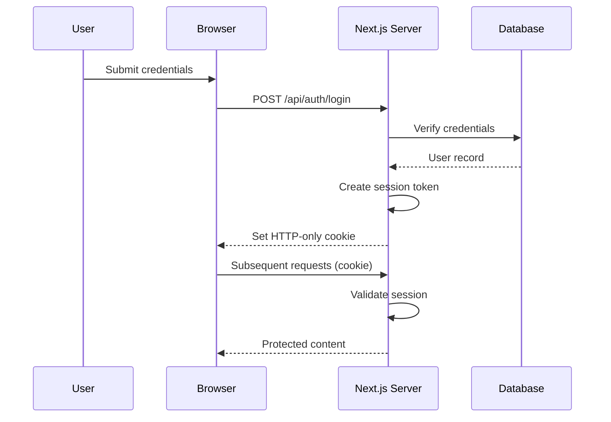

# MERIDIAN — Security Policy

> Security policies, vulnerability reporting, and data protection practices for the MERIDIAN Procurement Ecosystem.

---

## Supported Versions

| Version | Supported |
|---|---|
| 1.x | ✅ |
| < 1.0 | ❌ |

---

## Reporting a Vulnerability

We take security seriously. If you discover a security vulnerability, please follow responsible disclosure:

1. **Do NOT** file a public GitHub issue.
2. Email **security@meridian-platform.com** with details.
3. Include:
   - Type of vulnerability
   - Steps to reproduce
   - Potential impact
   - Suggested fix (if applicable)

You can expect:
- **24-hour** acknowledgment of receipt
- **7-day** initial assessment timeline
- Regular updates on remediation progress

---

## Data Protection

### In Transit

- All traffic served over TLS 1.3
- HSTS enabled with `max-age=63072000; includeSubDomains; preload`
- Content Security Policy restricts script/style sources
- HTTP headers hardened:
  - `X-Content-Type-Options: nosniff`
  - `X-Frame-Options: DENY`
  - `X-XSS-Protection: 1; mode=block`
  - `Referrer-Policy: strict-origin-when-cross-origin`

### At Rest

- **Credentials**: Environment variables only — never committed
- **Session data**: Signed and encrypted cookies
- **Database**: Connection strings via environment variables
- **API keys**: Stored in secrets manager (Vercel Environment Variables / AWS Secrets Manager)

---

## Authentication

- **Session-based auth** with HTTP-only, secure, same-site cookies
- **CSRF protection** via double-submit cookie pattern
- **Rate limiting** on login endpoints (configurable via Redis)
- **Password policies** enforced server-side

### Auth Flow

---

## Authorization

- **Role-based access control (RBAC)** — Admin, Manager, Viewer roles
- **Route protection** via Next.js middleware (`src/middleware.ts`)
- **API protection** — all API routes verify session + role
- **Org isolation** — data scoped to organization ID

---

## Input Validation

- **Client-side**: Zod schemas for all forms
- **Server-side**: Zod schemas re-validated on API routes
- **SQL injection**: Parameterized queries via ORM/prepared statements
- **XSS prevention**: React's built-in escaping + Content Security Policy
- **File uploads**: Type validation, size limits, virus scanning (future)

---

## Compliance

### GDPR

- Data minimization — only essential fields collected
- Right to deletion — user data can be purged on request
- Data portability — export user data in JSON format
- Cookie consent — only essential cookies (session) without consent

### SOC 2 (Target)

- Access controls
- Change management
- Incident response
- Encryption standards

---

## Security Checklist

- [x] HTTPS enforced
- [x] HSTS preloaded
- [x] CSP configured
- [x] XSS protection headers
- [x] No secrets in source code
- [x] Dependencies scanned (npm audit)
- [x] Session management
- [x] Input validation
- [x] Rate limiting ready
- [x] Error pages without stack traces

---

## Dependency Security

- Regular `npm audit` runs in CI
- Dependabot / Renovate for automated updates
- Snyk or similar for vulnerability scanning (future)
- Pin major versions for critical dependencies

---

## Incident Response

1. **Detection** — Automated monitoring alerts
2. **Containment** — Revoke compromised keys, isolate affected systems
3. **Eradication** — Patch vulnerability, rotate secrets
4. **Recovery** — Restore from clean backup
5. **Post-mortem** — Root cause analysis within 72 hours

---

## Contact

- **Security**: security@meridian-platform.com
- **Engineering**: engineering@meridian-platform.com
- **PGP Key**: Available on request
